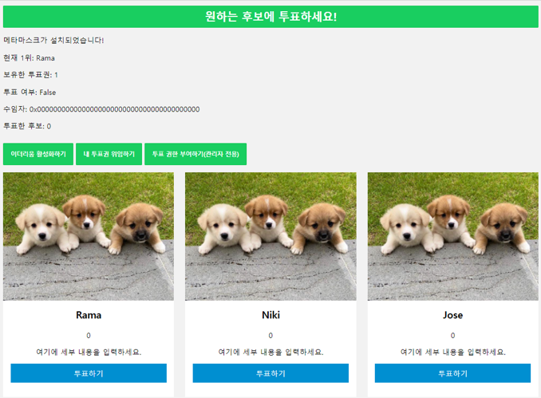

# ethereum-vote-flask-example

## Describe
Examples of Metamask, Flask, and Ethereum websites.

메타마스크와 플라스크, 이더리움 웹사이트에 대한 예시입니다.

## isntall solc
```bash
sudo add-apt-repository ppa:ethereum/ethereum
sudo apt-get update
sudo apt-get install solc
cp /usr/bin/solc /usr/local/bin/solc
```

## install requirements.txt
```bash
pip install -r requirements.txt
```

## start server
실행하기 전에 application.py에서 Ganache IP를 변경하세요.
Change the Ganache IP in application.py before running.

```bash
python application.py
```


## Screenshot

